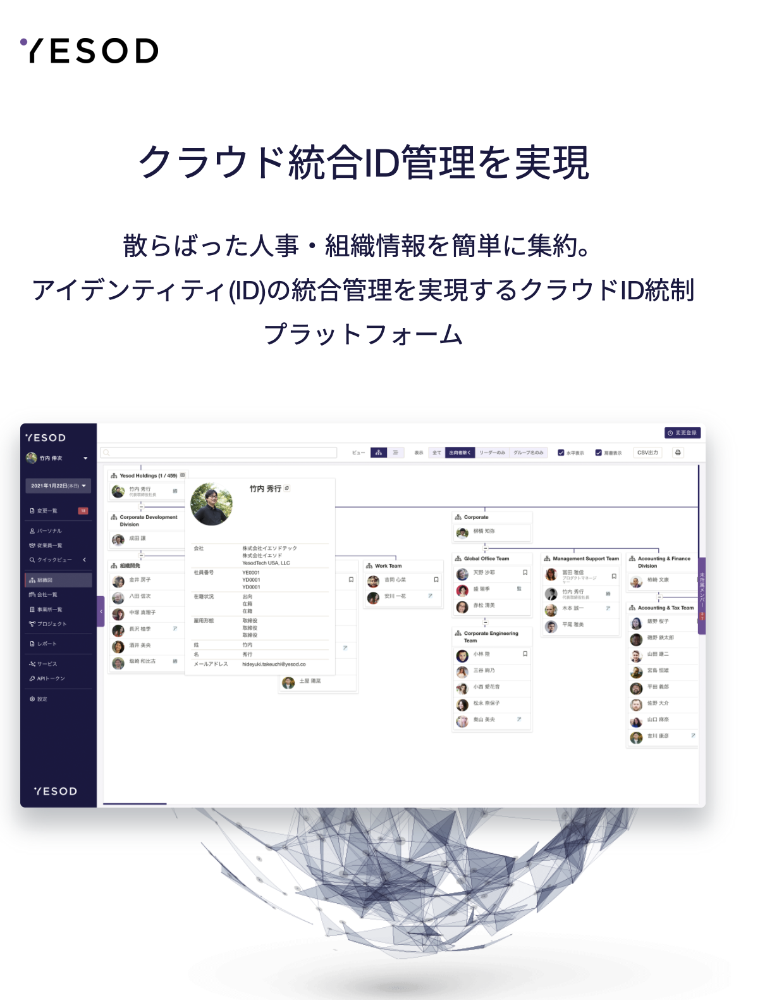

# 業務システムの銀の弾丸？　 メモ機能を考察する

UI/UXデザイナーLT会 - vol.6

---
# 自己紹介

- 腹筋ローラーの力を信じろ
（Twitter: @8845musign）
- 株式会社イエソド所属
- 業務システムのUIデザインを中心に、プログラミングや運用、プロジェクトの進行管理まで、必要なことを必要なタイミングにいろいろやる人

---

<!-- _class: lead -->
# 業務システムには「メモ機能」を 求められることがある

---

# 経費申請システムの申請時に入力可能なメモ

引用元: https://www.teamspirit.com/ja-jp/blog/entry/teamspirit-9.html

---

# 保存したインポート設定に記入可能なメモ

---

# Macのファイル詳細に 入力可能なメモ

---

<!-- _class: lead -->

# 「メモ」はどういう要求から 設計されるのか?

---

<!-- _class: lead -->
# 実際の「メモ」の利用例に 焦点を当ててみる

---

# メーラーのメモをフル活用した話

- お客様からの依頼メールを受け取って、データをシステムへ投入する業務
- 当時使っていたメーラーでは、メールにメモが追加可能だった
- メールとメモは全員に共有されていた

---

#  ユースケース

- 作業するメールに、自分が担当であることを記載
- 作業の進捗状況をメモ
    - タスクがどこまで完了したか
    - お客様とのやりとりステータス
- 完了をメモ

---

#  ユースケース

- 作業するメールに、自分が担当であることを記載 → **アサイン管理**
- 作業の進捗状況をメモ
    - タスクがどこまで完了したか
    - お客様とのやりとりステータス
- 完了をメモ

---

#  ユースケース

- 作業するメールに、自分が担当であることを記載 → アサイン管理
- 作業の進捗状況をメモ → **個々ののTODO管理、作業ログ**
    - タスクがどこまで完了したか
    - お客様とのやりとりステータス
- 完了をメモ

---

#  ユースケース

- 作業するメールに、自分が担当であることを記載 → アサイン管理
- 作業の進捗状況をメモ → 個々ののTODO管理
    - タスクがどこまで完了したか
    - お客様とのやりとりステータス
- 完了をメモ → **全体のTODO管理**

---

<!-- _class: lead -->

# 創意工夫によってさまざまなケースで メモは *それなりに*機能する

---

<!-- _class: lead -->
# それぞれ専用のツールを導入/開発した方がより 効率化できるのでは？

---

# それは確かに正論ですが

- メールを起点にタスクが回るのであれば、メール自体に情報を付与したい
    - 横断的にツールを行き来するめんどくささ
- 細かい生産性を上げるための予算は降りなかった😇
- 明日から業務を改善したいのに、ツール選定/開発に時間をかていられない

---

<!-- _class: lead -->

# 最近のヒアリング(情シスの方)

---

<!-- _class: lead -->

- ツールは何かを保存し名前をつけることができる
- ただし、名前や設定から、「なぜそれが生まれたのか？なぜ存在するのか？」を推察することが難しい
	- １人で業務をやるのであるのなら良いが
- 行間を埋めるために、wikiやスプレッドシートでの情報管理が始まる
（腹筋の心の声: またスプシーくんかよ……ウンザリ。でもスプシーくんは我々プロダクトの足りない部分を引き受けて頑張ってくれてるんだよな。ごめんな。でも嫌い。）
- またはSlack上で質問のやりとりが行われ、流れる
- なのでメモが欲しい

---

<!-- _class: lead -->
# 現場に隠れた、ツールでは解決しきれていない コミュニケーション課題をメモは解決するかも

---

# 結論: メモとはなんなのか？

- 抽象的なツール
    - 抽象化された要求
    - 抽象的なユースケース
    - 抽象的なデータ構造

---

# ユースケースだけからはメモは生まれない

- 個人の体験をデザインしてコントロールしてやろう、ということは可能なのだろうか
    - 作られたユーザー像と現実のギャップは確実にある
    - 明確に定義をすればするほど、玉虫色の部分は失われる
- **具体から抽象に進んで、遊びを持たせることはデザインにおいて重要**
  - 塩梅が難しいが
---

# ユーザーに自由を開放する

- 初期の設計から、あらゆる要求・ユースケースを想像しきることは不可能
- ユーザーを自由に「遊ばせる」
- その遊びから次の解が見えてくるかもしれない

---

# ユースケースを狭めるシグニファイア的な発想から、アフォーダンスつまり可能性のデザインへ
- シグニファイア→これはこう使ってください
- 可能性→これはAもBもCも（工夫次第で）できますよ
    - それどころか、あなたが変われば（スキルが高まる or 別のツールと組み合わせる）もっとできることが増えますよ
---

# メモ機能ってそういうもんですよね（多分）

---

# （おまけ1）「業務システムだから」XXXはホント？

- **そんなわけはない。前提条件で全部変わる**
- 例: 業務システムは毎日使うもの。ユーザーは慣れる
    - 担当が退職して溜まった知見が消えたり
        - システムの利用がつらくて退職されることも……
    - 月一しか使わない、経費生産システムありますよね
- 都度ユーザーと向き合ったが良い
- **この発表はタイトル詐欺**

---

# （おまけ2）メモは銀の弾丸か？

- そんなことはない
    - むしろ免罪符になる
        - 「メモで十分だら改善しなくてOK」
    - 運用と共に、カオスとなることもある
        - 何かしらの記載ルールが決まったメモ。読み解くためのマニュアルが必要
        - ex. 日付の記載がない、この古いメモは今も有効なのか？

---

# （おまけ2）メモは銀の弾丸か？

- ある段階で、機能の切り出しは必要
- 私たちは、メモという抽象から具体に揺り戻しをしなくてはならい
- この抽象と具体のループによって、システムは磨かれるのでは
    - メモはそのきっかけになるという点で、メモ機能は**デザインのための道具**でもある

---

# 宣伝

- 最高のCSS本を翻訳しました
- 弊社ではエンジニアを募集しています

---

# Every Layout

モジュラーなレスポンシブデザインを実現するCSS設計論

---

# 株式会社YESODではエンジニアを募集しています！

- SaaSを通して、全ての働く人が行き来き自由に働けるサンドボックスを作ることを目指しています
- KotlinもしくはTypeScriptをかける方募集中です
- 各種採用媒体で募集中です。もしくはDM頂けますと🙏

---

# ご清聴 ありがとうございました